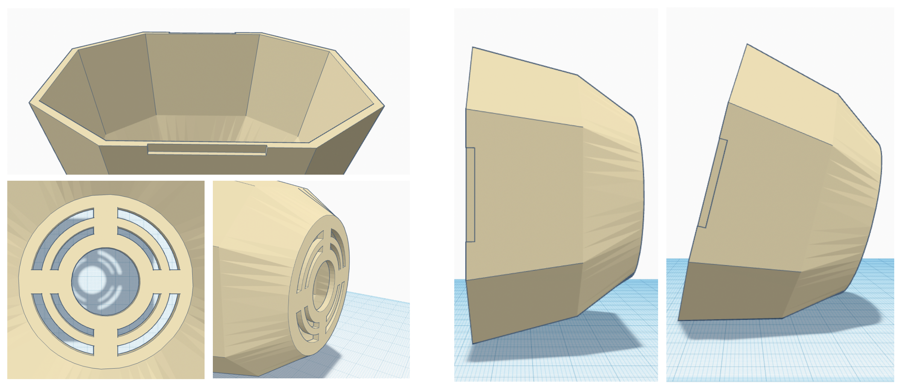
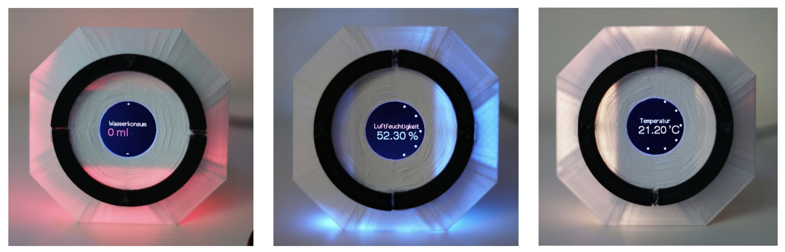
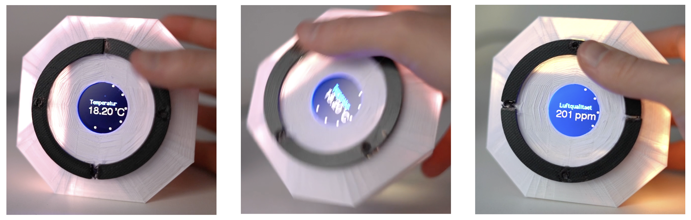

# The Wellbething

Team project of Information visualization module at TU Dresden University.
A smart device that tells you if you've consumed more than the recommended amount of water per day.

### Used tools and techniques

- Arduino ESP32
- C++
- 3D Printer
- Tinkercad
- Final Cut Pro

### Function

- Temperature
- Humidity
- Water Consumption
- Air Quality

### Documentation

[Link to documentation](https://github.com/Taeeun-Kim/The_Wellbething/blob/main/Documents/Gruppe1_Dokumentation.pdf)

### TechnicalDocumentation

[Link to technical documentation](https://github.com/Taeeun-Kim/The_Wellbething/blob/main/Documents/Gruppe1_Technische_Dokumentation.pdf)

### Overview

